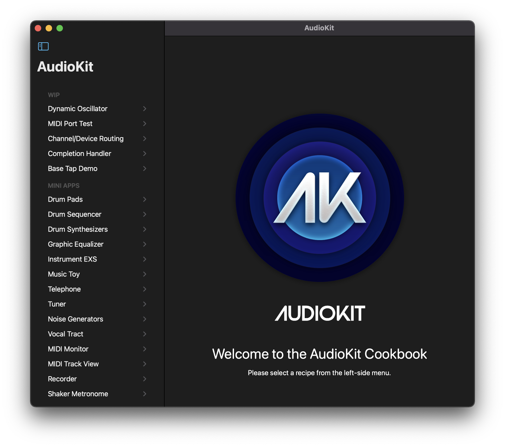

# AudioKit Cookbook for iOS and macOS (via Catalyst)

## Canonical Examples for Using the AudioKit 5 Swift Package

Most of the examples that were inside of [AudioKit](https://github.com/AudioKit/AudioKit/) are now in this single iOS / macOS Catalyst application.

## Top Level Overview

* `ContentView.swift` contains the menu screen.
* `Recipes/` contain all of the one-screen demos.
* `Resources/`, `Samples`, and `Sounds` contain shared audio and MIDI content.
* `Reusable Components/` contains the code widgets that are shared between recipes.

## Recipes

Each recipe is one file that contains a few related objects:

* `Conductor` sets up all the AudioKit signal processing.
* `Data` is a structure that holds the state of the demo. It is used by both the view and the conductor.
* `View` creates the SwiftUI user interface for the recipe.

## On-going development

Since this is the primary example for AudioKit, it will continue to evolve as AudioKit does. There are plenty of opportunities to help out.
Check out [Github Issues](https://github.com/AudioKit/Cookbook/issues) for some specific requests.

